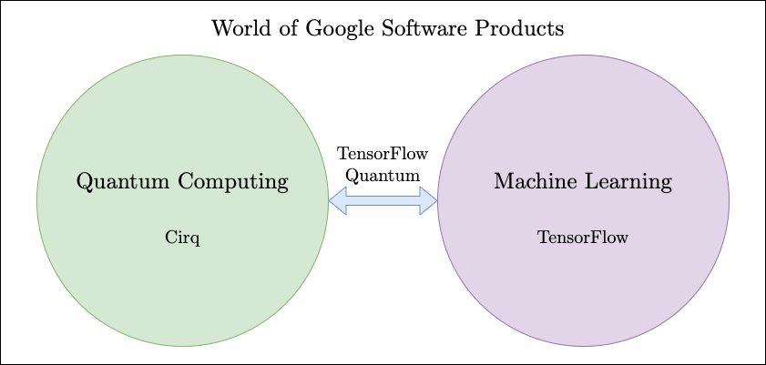
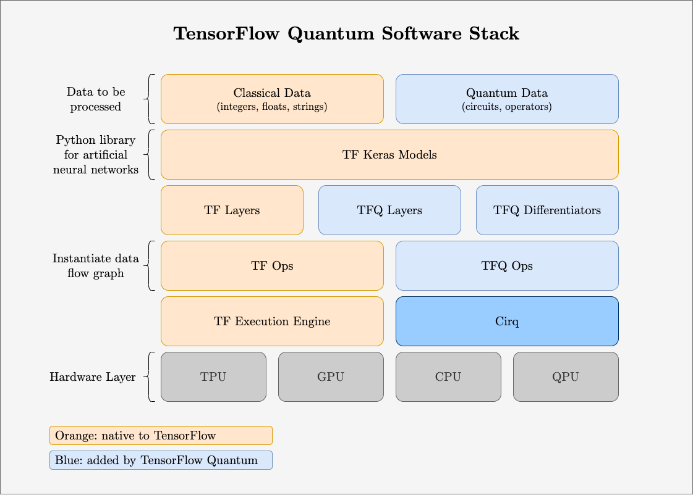
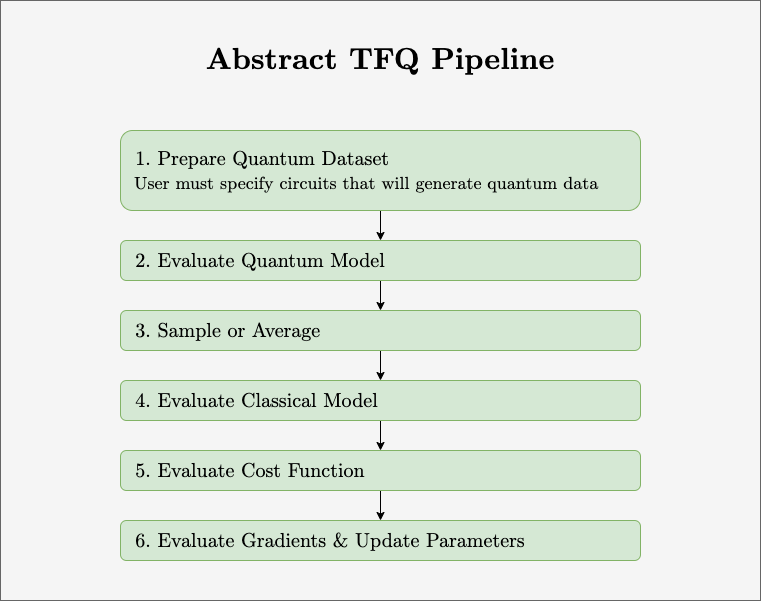

-------
This post explores Part II, "Software Archtecture & Building Blocks," of the paper "TensorFlow Quantum: A Software Framework for Quantum Machine Learning" paper.

### What is TensorFlow Quantum?

In the world, there exists two Google software products belonging to two separate communities: 

> - [Cirq](https://github.com/quantumlib/Cirq), used by the quantum computing world, is a tool to build quantum circuits 

> - [TensorFlow](https://www.tensorflow.org), used by the machine learning world, is a tool to build machine learning algorithms

The [TensorFlow Quantum library](https://www.tensorflow.org/quantum/) bridges these communities into a hybrid world, [quantum machine learning.](https://en.wikipedia.org/wiki/Quantum_machine_learning)

---------

### Introduction to TensorFlow Quantum

The TensorFlow Quantum paper[^1] provides discussions of the following:
1. The tools' individual capabilities
2. Challenges of combining the tools
3. Ideas behind architecture of combination
4. Overview of performance

#### The tools' individual capabilities
Both tools are languages that deal with the elements required by each community.

1. Cirq makes it possible to build quantum circuits using qubits, gates, circuits, and measurement operators. These circuits can be operated on simulations of quantum computers or actual near term hardware.

2. TensorFlow makes it possible to build computations visually with stateful dataflow graphs made up of tensors (directed edges) and operations (nodes).

#### Challenges of combining the tools

The straight-forward approach: States-as-edges architecture
> TensorFlow graph edges = Cirq quantum states\
> TensorFlow operations = Cirq state transformations

This architecture has proved to be suboptimal for the following reasons:
1. The graph must be rebuilt every time a different circuit is run
2. There is no easy way to embed a quantum dataflow graph on a quantum processor
3. It's difficult to define quantum gates and measurements within TensorFlow

For these reasons, TFQ does not implement the states-as-edges architecture, though the system motivates many core design principles.

#### Ideas behind architecture of combination

TFQ has four design principles:

1. **Differentiability:** the system must support operations from calculus (e.g. differentiability) since this is the key computation in back-propagation;

2. **Circuit batching:** the system must support re-running parameterized model circuits, since it handles quantum data;
3. **Execution backend agnostic:** the system must support running and comparing a model in both a simulation and real hardware;
4. **Minimalism:** since both Cirq and TensorFlow offer a large and well-defined set of tools to their respective communities, the system should try to leverage these tools as much as possible, so that users don't need to unnecessarily re-learn a new interface.

The system is set up with the following in mind:

- TensorFlow tensors (edges) = Cirq circuits and other quantum computing constructs

- TensorFlow Operators (nodes) = the conversion of Cirq tensors into classical data (where Cirq objects become TensorFlow string flows).

The TensorFlow Quantum paper provides a detailed bottom-up overview of the design. Below is an annotated illustration of the TFQ software stack. On the top of the stack is the user's input data to be processed, and on the bottom is the hardware. Orange boxes are elements native to TensorFlow. Blue boxes are elements added by TensorFlow Quantum to integrate Quantum Computing.

Below is an abstract illustration of the TFQ pipeline that summarizes the execution steps performed by a minimum working example:

More detailed technical explainations with minimum working examples can be found in the paper[^1].

### References
[^1]: Broughton, Michael, et al. “TensorFlow Quantum: A Software Framework for Quantum Machine Learning.” ArXiv.org, 6 Mar. 2020, arxiv.org/abs/2003.02989.
