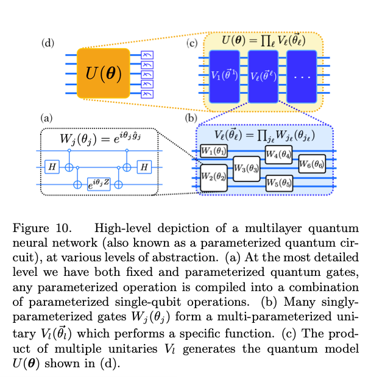

-------
The TensorFlow Quantum paper by Broughton, *et al.* Section III *Theory of Hybrid Quantum Classical Machine Learning* uses a graph to demonstrate the inner workings of a multilayer quantum neural network[^1]. Here, we attempt to break the graphic down, piece by piece, to understand what is happening.

### The Diagram by *Broughton, et al.*

The caption describes from the lowest level to the highest level. In this way, it first covers the most detailed aspects and then becomes more general. However, this is a front-heavy approach. In my post, I re-iterate the caption in my own words, starting with the highest level and proceeding to the lowest level.

#### The Unitary

The paper labels the highest level graphic as (d). It shows a general unitary representing the entire quantum model. It can be considered a black box which receives input and produces results as output.

In the next level, (c), U is equivallent to the product of multiple smaller unitaries, named V. The multiple horizontal lines indicate that V is multi-parametereized, e.g. it accepts more than one input at a time. I believe these inputs are processed in parallel.

In (b), V is made up of the product of many quantum gates named W. These accept only a single input at a time.

Finally (a) shows that each W is composed of exponentials working with single-qubit operations. 

### References
[^1]: Broughton, Michael, et al. “TensorFlow Quantum: A Software Framework for Quantum Machine Learning.” ArXiv.org, 6 Mar. 2020, arxiv.org/abs/2003.02989.
