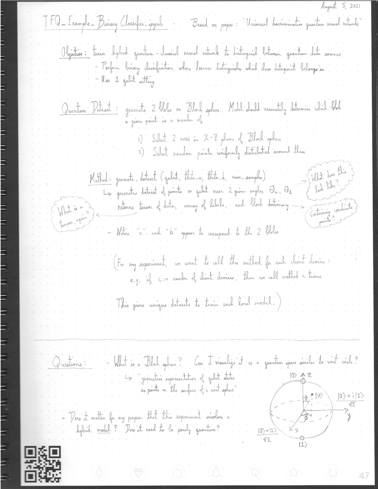
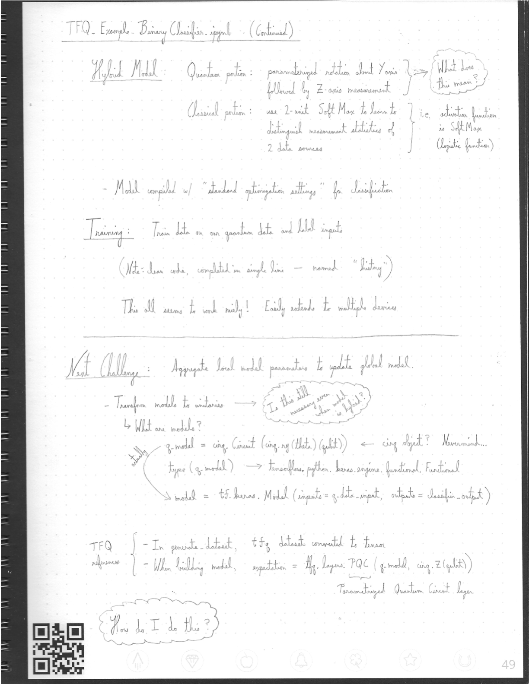

-------
Here I provide handwritten notes for a research snippet provided by TensorFlow: https://github.com/tensorflow/quantum/blob/research/binary_classifier/binary_classifier.ipynb

More information regarding [Bloch spheres](https://en.wikipedia.org/wiki/Bloch_sphere).

