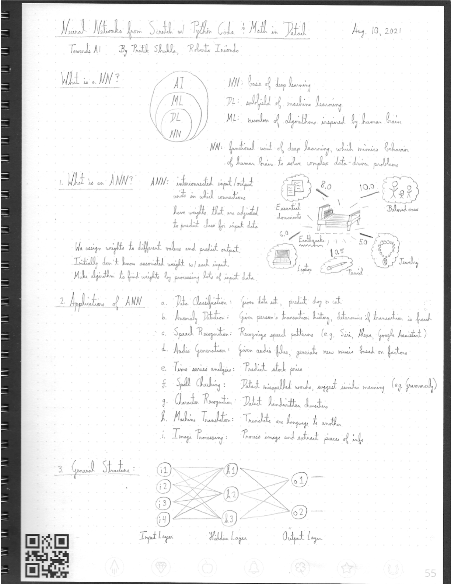
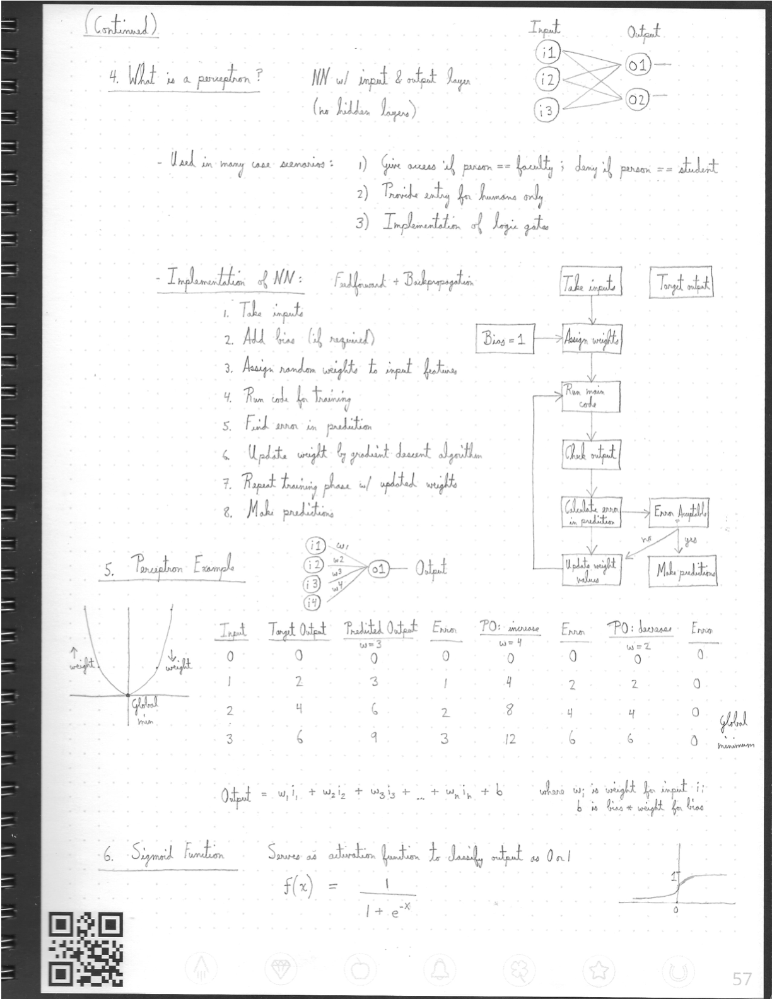

-------
Below I provide handwritten notes summarizing a blog post about Neural Networks: \
https://pub.towardsai.net/building-neural-networks-from-scratch-with-python-code-and-math-in-detail-i-536fae5d7bbf

 