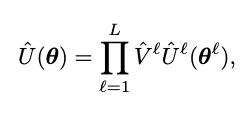
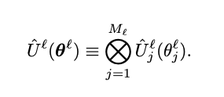
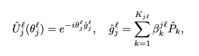
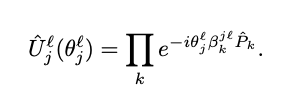
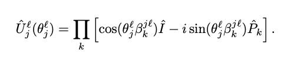
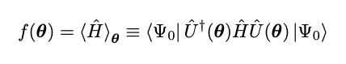
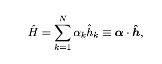
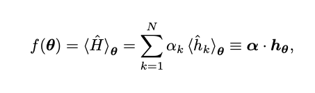
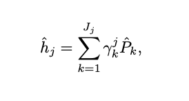

-----------------------------
*(Last updated: June 8, 2021)*

Please note, this draft is a work in progress. For the next few days, I will continue to write here about the equations as I better understand them. Once finalized, I will update the publication date.

The paper "TensorFlow Quantum: A Software Framework for Quantum Machine Learning" by Michael Broughton, et al. introdues the TensorFlow Quantum library with respect to implementing hybrid models that handle classical or quantum data [^1]. In this post, I attempt to give a brief explaination of the equations given in Section III, "Theory of Hybrid Quantum-Classical Machine Learning."

### Equation (1)

This equation can be considered the starting point for our Quantum Neural Network. Result Û is the product of the two matrices represented by V̂ and Û. The superscripts represent indices (instead of exponents); so if L is the total number of layers in the network and l is any layer from 1 to L, then each layer is multiplied together. V̂ is non-parametric, and Û has variational parameters

### Equation (2)

### Equation (3)

### Equation (4)

### Equation (5)

### Equation (6)

### Equation (7)

### Equation (8)

### Equation (9)

### References
[^1]: Broughton, Michael, et al. “TensorFlow Quantum: A Software Framework for Quantum Machine Learning.” ArXiv.org, 6 Mar. 2020, arxiv.org/abs/2003.02989. 

