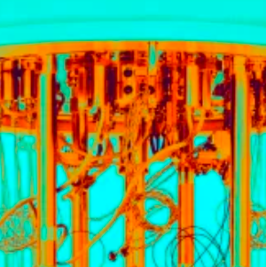
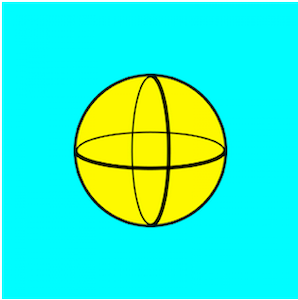
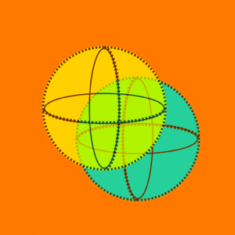

-----------------------------
*(Last updated: June 8, 2021)*

On 29 January 2019, the MIT Technology Review published an article[^1] by Martin Giles on the subject of Quantum Computing. This piece, titled "Explainer: What is a Quantum Computer" is a short overview of what makes quantum computing unique and how it contributes to the technological world. In particular, this article stands out to me because of its easy-to-comprehend definitions of quantum properties. Here, I outline these properties:

---------------
### Definitions

[Quantum computers:](https://en.wikipedia.org/wiki/Quantum_computing)
Machines that use fundamental principles of quantum mechanics to gain tremendous computing power and outperform supercomputers.

[Qubit:](https://en.wikipedia.org/wiki/Qubit)\
The quantum equivalent of a bit. It is represented by subatomic particles (either electrons or photons) and can be hard to control.

[Superposition:](https://en.wikipedia.org/wiki/Quantum_superposition)\
The ability for a qubit to be simultaneously be in multiple states (in numerous combinations of 0 and 1). Scientists currently achieve this state with the aid of precision lasers or microwaves beams.

[Entanglement:](https://en.wikipedia.org/wiki/Quantum_entanglement)\
The phenonmenon when a pair of qubits exist in a single state and the change of one qubit's state changes the other qubits state in a predictable way, regardless of distance.

[Decoherence:](https://en.wikipedia.org/wiki/Quantum_decoherence)\
The phenonmenon when "noise" in the environment affects qubits' quantum behavior and causes decay and eventual disappearance. Scientists try to avoid decoherence by isolating the qubits from the environment in super-cooled fridges (IMB, Google, Rigetti Computing) and vacuum chambers (IonQ). However, since the quantum state is extremely fragile, qubits are easily affected, leading to wrong results. Current methods of "fixing" the results include "Smart Quantum Algorithms" and a futuristic "logical qubit," a highly reliable qubit made up of thousands of standard qubits (notice we have not achieved this yet since we can only put a couple hundred qubits together to date).

[Quantum Supremacy:](https://en.wikipedia.org/wiki/Quantum_supremacy)\
The point at which quantum computers are completing problems that are beyond the reach of supercomputers. (Note: at the time of this publication in January 2019, supremacy had not yet been achieved. In December 2019, Google announced that they achieved quantum supremacy.[^2])

(Images from www.technologyreview.com/2019/01/29/66141/what-is-quantum-computing)

### References
[^1]: Giles, Martin. “Explainer: What Is a Quantum Computer?” MIT Technology Review, MIT Technology Review, 2 Apr. 2020, www.technologyreview.com/2019/01/29/66141/what-is-quantum-computing/. 
[^2]: Press, Associated. “Google Touts Quantum Computing Milestone.” MarketWatch, MarketWatch, 23 Oct. 2019, www.marketwatch.com/story/google-touts-quantum-computing-milestone-2019-10-23. 