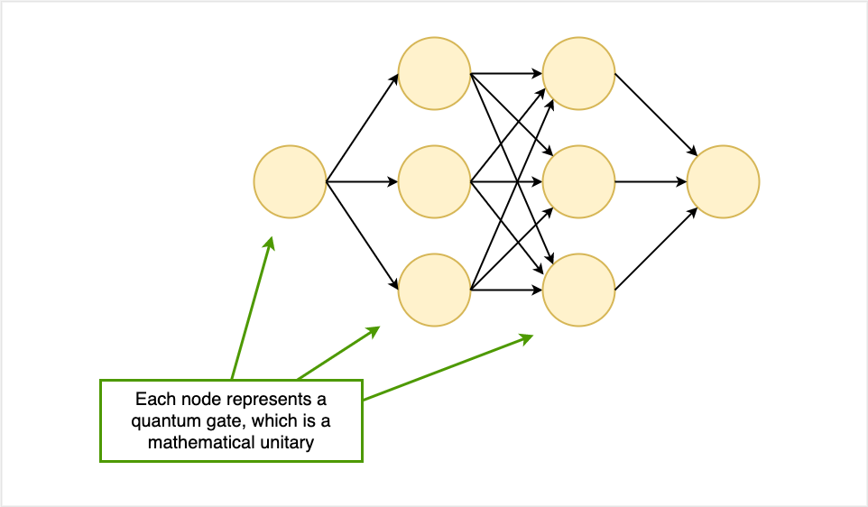
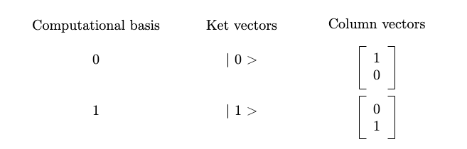
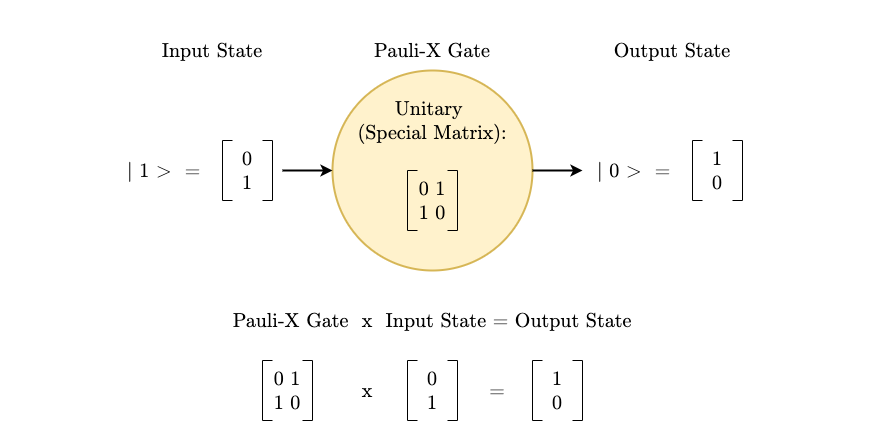

-------
The following post is a simple introduction to how quantum gates relate to matrices.
### A Quantum Neural Network:

Quantum neural networks are made up of layers nodes connected by edges. Here, we imagine each node as a quantum gate which receives an input matrix and passes an output matrix to the next layer of gates. Mathematically, these gates are [unitaries](https://mathworld.wolfram.com/UnitaryMatrix.html), matrices with special properties (where the conjugate transpose is equivalent to the matrix inverse[^1]). 
  
### Qubits

Qubits are the quantum equivalent to the classical bit. Classical bits, represented by 0 and 1 and manipulated by Boolean Algebra, are the building blocks of classical computers. Qubits, represented by 0, 1, or superposition of the two, are the building blocks of quantum computers[^2]. 

A qubit is represented by a vector that determines its probability of being either 1 or 0. Its computational bases are 0 and 1, which can be represented as either ket vectors or column vectors:

### Quantum Gates & Matrices

How do quantum gates, matrices, and qubits relate? Qubits are the number system in this mathematical quantum universe, and matrices serve as the quantum logic gates.

For example, let us consider the Pauli-X gate, which is used to flip between the bases[^3].

### References
[^1]: “Unitary Matrix.” Wolfram MathWorld, mathworld.wolfram.com/UnitaryMatrix.html. 
[^2]: Voorhoede, De. “What Is a Qubit?” Quantum Inspire, www.quantum-inspire.com/kbase/what-is-a-qubit/. 
[^3]: Coggins, Macauley. “Matrix Representations of Quantum Logic Gates.” Quantum Computing UK, Quantum Computing UK, 13 May 2020, quantumcomputinguk.org/tutorials/introduction-to-quantum-logic-gates-and-matrices. 
